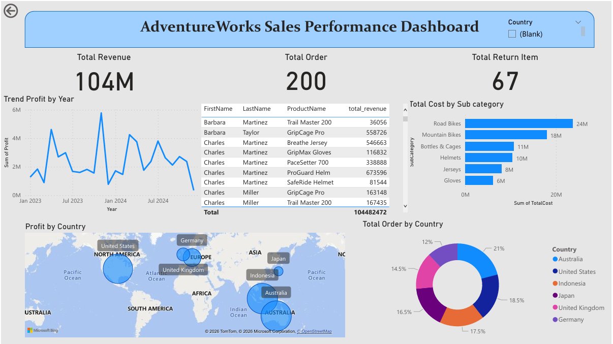

# AdventureWorks Sales Performance Dashboard
----

An interactive Power BI dashboard designed to monitor sales performance, identify business trends, and provide actionable insights using the AdventureWorks dataset.

## Dashboard Preview

The image below shows a preview of the dashboard. For a detailed view, please open the [PDF]() version.
 

This interactive dashboard provides an overview of AdventureWorks' sales performance by analyzing revenue, orders, returns, product performance, profitability, and geographical distribution. It enables users to monitor key business metrics and gain actionable insights through interactive visualizations.

## Problem Statement

AdventureWorks generates sales data from multiple products, customers, and countries. Without a centralized dashboard, it is difficult to monitor overall business performance, identify sales trends, evaluate product performance, and compare performance across different markets. This dashboard was developed to transform raw sales data into meaningful insights that support better business decision-making.

## Business Questions

This dashboard is designed to answer the following questions:

- What is the total revenue generated?
- How many total orders were received?
- How many items were returned by customers?
- How has profit changed over time?
- Which customer-product combinations generated the highest revenue?
- Which product subcategories have the highest total cost?
- How is profit distributed across different countries?
- Which country contributes the highest number of orders?

## Data Understanding & Preparation

The dashboard uses the AdventureWorks Sales Dataset, which contains transactional sales data from multiple countries, customers, and product categories.
View Full [Dataset](https://github.com/nabilahnovra06/AdventureWorks-Sales-Performance-Dashboard/tree/main/dataset)

Data Preparation

Before building the dashboard, the dataset was prepared by:

Importing the dataset into Power BI.
Reviewing the dataset structure and data consistency.
Verifying data types (date, numeric, and categorical fields).
Creating relationships between related tables.
Creating DAX measures for key performance indicators (Total Revenue, Total Orders, and Total Return Items).

The dataset required minimal data cleaning because it was already well-structured for analysis.

## Analysis Process

The dashboard uses several visualizations to answer the business questions. TTo make data exploration effortless, the dashboard features an interactive Country Slicer that acts as a dynamic filter. With just one click, you can isolate any country to instantly refresh the map and donut chart. This lets you seamlessly pivot from a high-level global overview to a laser-focused, localized data analysis.

Below is a detailed explanation of each visualization.

#### **Key Performance Indicators (KPIs)**

The KPI cards provide a high-level overview of AdventureWorks' sales performance by summarizing the most important business metrics. These indicators directly answer the following business questions:

- What is the total revenue generated? The dashboard shows that AdventureWorks generated a total revenue of 104M, representing the overall sales performance during the analysis period.
- How many total orders were received? A total of 200 orders were successfully completed, indicating the overall transaction volume.
- How many items were returned by customers? The dashboard records 67 returned items, providing insight into product returns and helping evaluate customer satisfaction and operational performance.

#### **Trend Profit by Year**

This line chart illustrates the trend of total profit over time, enabling users to monitor changes in business performance throughout the analysis period. These chart directly answer the following business questions:

How has profit changed over time? Profit fluctuated throughout the analysis period, with several noticeable peaks and declines. This indicates that business performance was not consistent over time, highlighting the importance of continuously monitoring profit trends to support business planning and decision-making.

#### **Revenue by Customer and Product**

This table shows the total revenue generated by each customer and product combination. It helps identify which customer-product pairs contribute the most revenue. These table directly answer the following business questions:

Which customer and product generated the highest revenue contribution? Based on the table, Charles Martinez generated the highest revenue through the ProGuard Helm product, with a total revenue of 673,596. Other high-performing combinations include Barbara Taylor – GripCage Pro (558,726) and Charles Martinez – Breakthru Jersey (546,663). This indicates that a few customer-product combinations contribute significantly to overall revenue.

#### **Total Cost by Subcategory**

This bar chart compares the total cost across different product subcategories, making it easy to identify which categories require the highest spending. These chart directly answer the following business questions:

Which product subcategory has the highest total cost? The Road Bikes subcategory has the highest total cost at approximately 24M, followed by Mountain Bikes with around 18M. The remaining subcategories, such as Bottles & Cages, Helmets, Jerseys, and Gloves, have considerably lower total costs. This suggests that bike products account for the largest share of production or purchasing costs.

#### **Profit by Country**

This map chart visualizes the distribution of profit across different countries. The size of each bubble represents the volume of profit generated in that specific geographic region. These chart directly answer the following business questions:

How is the profit distributed across countries? Based on the chart, the profit is globally distributed across North America, Europe, Asia, and Australia. The United States and Australia show significantly larger bubbles, indicating they are the primary profit drivers for the business. Meanwhile, countries like the United Kingdom, Germany, Indonesia, and Japan contribute a relatively smaller portion to the overall profit.

#### **Profit by Country**

This donut chart illustrates the percentage share of total orders contributed by each country, making it easy to compare customer purchase frequency and volume across markets. These chart directly answer the following business questions:

Which country has the highest total orders? Australia has the highest number of total orders, accounting for 21% of the total share. It is closely followed by the United States at 18.5% and Indonesia at 17.5%. On the other hand, Germany records the lowest order volume at 12%.

## Key Insights

Based on the dashboard analysis, AdventureWorks generated a total revenue of 104M from 200 completed orders, though it also recorded 67 returned items. While profit fluctuated over time reflecting shifting business performance, Road Bikes emerged as the product subcategory with the highest total cost. Geographically, sales performance was distributed across six countries, with Australia leading the market by contributing the highest percentage of total orders at approximately 21%, closely supported by strong contributions from the United States.

## Business Recommendations

Based on the findings, the following recommendations are proposed:

Continue strengthening sales strategies in high-performing markets such as Australia.
Review high-cost product categories to improve profitability.
Investigate factors contributing to returned items and implement strategies to reduce return rates.
Monitor profit trends regularly to identify seasonal patterns and support business planning.
Focus marketing efforts on customer segments and products that consistently generate high revenue.

# Connect & Feedback
---
Thank you for exploring this project! If you have any questions, suggestions, or insights on how to improve this dashboard, please feel free to open an issue or connect with me. I'm always open to constructive feedback and exciting data collaborations!

